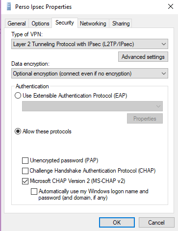

# Docker image for SoftEther VPN:
This will deploy a fully functional [SoftEther VPN](https://www.softether.org) server as a docker image.

Author container is available on [Docker Hub](https://registry.hub.docker.com/u/frosquin/softether/)
original [github project](https://github.com/cnf/docker-softether)

# Server and client Setup:
Example of
SSTP, OpenVPN and IPSec vpns
with android, linux and windows clients configurations
on a google cloud instance

## Server setup:
- Create a [google cloud platform account](https://cloud.google.com/)
Don't forget to use a strong unique password ;)

in this project [metadata](https://console.cloud.google.com/compute/metadata/sshKeys) add your ssh private key.
I assume you know how to create a ssh private/public key, otherwise plenty of tutorials are available online.
Once you got them write down your username and paste your public key info in the project ssh keys.

I'll be using john as username for the rest of the documentation.

### Open the required ports:
In your [networking interface](https://console.cloud.google.com/networking/networks) create a project and add the following firewall rules:

IPsec:
- udp:500
- upd:4500
- tcp:1701

Openvpn:
- udp:1194

For all these leave `IP ranges` filter and add `0.0.0.0/0` in `Source IP range` to allow any connection. the `<protocol>:<port>` entry must be added in
`Specified protocols and ports` section
you should already have default-allow-https and default-allow-ssh rules that are needed.


Ensure you write down the `targets` field for these rules to assign them to your server. Mines were
- *l2tp*
- *openvpn*
- *https-server*

### Create your instance:
Create a new instance in [Compute Engine / VM Instances](https://console.cloud.google.com/compute)

Be sure to select a close by area since it will greatly affect VPN performances
Shrink down the `Machine type` according to your usage (I am using a micro instance for my VPN and it's enough IMO)

For the `Boot disk` I recommend the latest stable CoreOS since we will be using a docker image.

Once created ensure you assign the right `network tags` to it. These must be the `targets tags` previously created in the firewall configuration
for me: I added
- *l2tp*
- *openvpn*
- *https-server*

Once created you should see the newly created instance in your instances list.
Write down the IP address:
here I'll use `35.187.666.666` adapt it with your own instance address.

## Softether install and configuration:
log on your newly created instance :
```
ssh -i .ssh/my_private_key john@35.187.158.38
```

### Pull the image:
```
docker pull frosquin/softether
```

### Start the container:
```sh
docker run -d --restart always --net host --cap-add NET_ADMIN --name softether frosquin/softether
```

### Configure the server:
This configuration is copied from a VPS server tutorial [Setup Openvpn, L2TP/IPSec & SSTP VPN using Softether](https://www.vpsserver.com/community/tutorials/14/setup-openvpn-l2tp-ipsec-sstp-vpn-using-softether/)

connect to your image:
```
docker exec -it softether bash
```
start the configuration tool:
```
./vpncmd
```

#### Changing Admin Password:
```vpnc
ServerPasswordSet
```
choose the password you want

#### Creating a Virtual Hub:
```vpnc
HubCreate myVpnHub
```
You can choose whatever name you want, I'll use this one in the following configuration

#### Enabling SecureNAT:
```vpnc
SecureNatEnable
```

#### Create your VPN user:
```vpnc
UserCreate john
UserNTLMSet
UserPasswordSet
UserAnonymousSet
UserRadiusSet
UserCertSet
UserSignedSet
UserPasswordSet john
```
To do according to the number of VPN users you wish

#### Activate L2TP/IPSec:
```vpnc
IPsecEnable
```
then answer the following questions
Enable L2TP over IPsec Server Function: *Yes*
Enable Raw L2TP Server Function: *No*

Enable EtherIP / L2TPv3 over IPsec Server Function: *No* Unless your Router is compatible with EtherIP / L2TPv3 over IPsec

Pre Shared Key for IPsec: Your `Preshared key` used in client configuration choose whatever you wish.

Default Virtual HUB in a case of omitting the HUB on the Username: *john@myVpnHub*

#### Activate SSTP & OpenVPN:
```vpnc
ServerCertRegenerate 35.187.666.666
ServerCertGet ~/cert.cer
SstpEnable yes
OpenVpnEnable yes /PORTS:1194
OpenVpnMakeConfig ~/openvpn_config.zip
```

#### Get your SSTP certificate:
Get your SSTP certificate
```sh
docker cp softether:/root/cert.cer ~/
```
then fetch it on your local machine:
```sh
scp john@35.187.666.666 ~/cert.cer ~/
```

Some VPN clients expect pem files. You can just rename `cert.cer` to `cert.pem`

#### Get your openvpn configuration:
Get your openVPN configuration:
on your cloud server
```sh
docker cp softether:/root/openvpn_config.zip ~/
```

and on your local machine:
```sh
scp john@35.187.666.666 ~/openvpn_config.zip ~/
```

## Linux OpenVPN configuration:
just extract and load the downloaded openvpn_config

## Linux SSTP configuration:
install your sstp-client packages
fill the following configuration:


## Linux l2TP/IPSec configuration:
install the required packages:
```
sudo apt-get install network-manager-l2tp network-manager-l2tp-gnome
```


I suggest the following configuration:


If you want to use a different algorithms configuration you can query the server capabilities using the script ike-scan.sh. (taken from [the network manager troubleshooting page](https://github.com/nm-l2tp/network-manager-l2tp/wiki/Known-Issues))

```
sudo apt-get install ike-scan
sudo ./ike-scan.sh <YourServerIpAddress> | grep SA
```

## Windows SSTP/IPSec configuration:
Go in Network and sharing center
Add a new connection


Choose a Workplace VPN connection


Create a new connection


Choose VPN connection


Fill your server address and VPN connection name


### IPSec
Security parameters



in the advanced panel fill your Preshared Key


### SSTP
SSTP connection settings are simple


#### certificate
In order to use SSTP You must add your server certificate in Windows.
Here is a [Windows tutorial](http://www.thewindowsclub.com/manage-trusted-root-certificates-windows)

## Mobile IPSec configuration (android):
go in you phone VPN settings (Wireless & &Network menu)
Add a new VPN with the following configuration
- Name: Choose a funny one
- Type: L2TP/IPSec PSK
- Server address: your cloud instance IP address
- IPSec identifier: your username
- IPSec pre-shared key: The Preshared key you configured
Leave the other fields empty

Upon connection fill in your VPN username and password
You should be connected

## Save softether configuration:

In order to save the configuration, you can fetch it on the disk using:
```sh
docker cp softether:/usr/local/vpnserver/vpn_server.config ~/
```

you can then start your container with the following command to use the local configuration
```sh
docker run -d --restart always -v ~/vpn_server.config:/usr/local/vpnserver/vpn_server.config --net host --cap-add NET_ADMIN --name softether frosquin/softether
```
this way you don't loose your configuration if the instance or docker are restarted or if you wish to switch instance, cloud platform ...

## Shadowsocks

If you wish to add shadowsocks capabilities see the (docker container](https://hub.docker.com/r/mritd/shadowsocks/)
following the setup in [docker-shadowsocks README](https://github.com/lerignoux/docker-shadowsocks)
